```
 ____              ____             ___                       ___   ___  _
|  _ \  _____   __/ ___|  ___  ___ / _ \ _ __  ___           / _ \ / _ \/ |
| | | |/ _ \ \ / /\___ \ / _ \/ __| | | | '_ \/ __|  _____  | | | | | | | |
| |_| |  __/\ V /  ___) |  __/ (__| |_| | |_) \__ \ |_____| | |_| | |_| | |
|____/ \___| \_/  |____/ \___|\___|\___/| .__/|___/          \___/ \___/|_|
                                        |_|
```

# 🌤️ Weather App - Cloud-Native Deployment on AWS

A Python Flask weather application containerised with Docker and deployed using multiple AWS services. This project demonstrates containerisation, Infrastructure as Code (IoC), Kubernetes orchestration, serverless container hosting, and real-time cluster observability.<br>
<br>

The project is originally intended as a team collaboration effort with seven other former AWS reStart cohort mates. The task was given as an architecture diagram (the first one below) together with an 8-milestone build plan. In this repo, I have attempted an individual implementation ahead of the group build for the purpose of familiarising myself and learning as much as possible, so that I am not utterly clueless when the team collaboration begins, but can contribute meaningfully.<br>
<br>

While this project deploys a weather application as its working example, the weather app itself is intentionally simple - it is not the point. The real focus is the infrastructure, tooling, and processes that surround it. This repository is designed to serve as a practical template for applying DevSecOps principles to real-world software development and application deployment. It demonstrates how to build a secure, automated, and observable continuous integration and continuous delivery (CI/CD) pipeline from code commit all the way through to a running containerised workload in the cloud. Key practices include:<br>
* Infrastructure defined and versioned as code with Terraform<br>
* Container images built and shipped automatically via GitHub Actions CI/CD<br>
* Workloads deployed consistently across environments using Kubernetes<br>
* Cluster health monitored in real time with Prometheus and Grafana.<br>
<br>

Any application can be dropped into this pipeline in place of the weather app - the deployment model, tooling, and workflow remain the same. Think of it as a reusable blueprint: build once, adapt for any project.

---

## 🌐 Live Demo

| Deployment     |               URL                             |
|----------------|-----------------------------------------------|
| AWS App Runner | https://82t2izwhnm.us-east-1.awsapprunner.com |

---

## 🧩 Problem Statement:

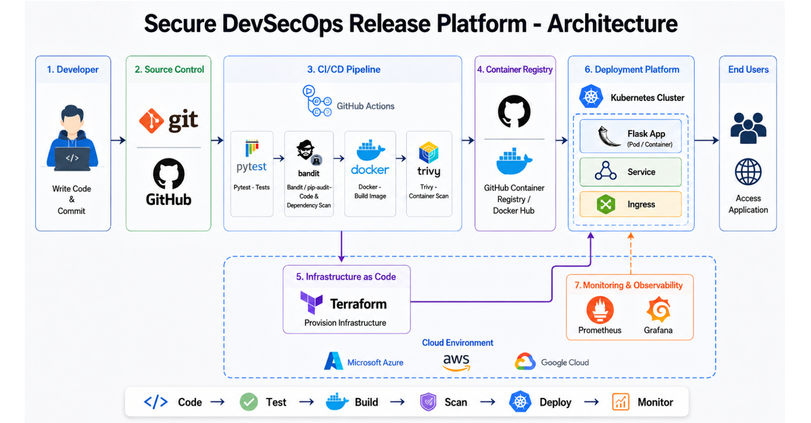
<br>

#### Milestone Plan:

1. Application Setup - Build a simple Flask web application with a home endpoint and a health check endpoint. The result is a working app that can run locally.

2. Version Control and Testing - Store the project in GitHub, agree a simple branch and pull request approach, and add Pytest tests so the team can check changes safely.

3. Containerisation - Create a Dockerfile, build the image locally, and confirm the application runs correctly inside a container.

4. CI/CD Pipeline - Use GitHub Actions to automatically run tests and build the Docker image whenever code is pushed or a pull request is opened.

5. Security Scanning - Add DevSecOps checks such as dependency scanning, static code checks, and container scanning with tools like pip-audit, Bandit, and Trivy.

6. Registry and Kubernetes Deployment - Push the approved Docker image to a container registry, then deploy it to Kubernetes using deployment, service, and ingress configuration.

7. Infrastructure and Monitoring - Use Terraform to define/provision infrastructure and add Prometheus and Grafana so the team can monitor application and platform health.

8. Documentation and Handover - Write a clear README with setup steps, architecture explanation, pipeline screenshots, deployment evidence, monitoring screenshots, and future improvements.

### ----- End of Problem Statement -----

<br>

---

## 🏗️ Solution Architecture Overview

In this project, the above architecture has been implemented exactly as shown, not only to the letter but also carried out to every jot and tittle. The schematic below shows a high-level overview of my AWS-aligned cloud-native implementation.

```text

Developer → Web App Dev → Docker Build (local) → git push → GitHub → GitHub Actions (CI/CD)
                                                                              ↓
                                                                        Amazon ECR
                                                                       ↙           ↘
                                                                Amazon EKS     AWS App Runner
                                                              (Kubernetes)      (Serverless)
                                                                    ↓
                                                         Prometheus + Grafana
                                                           (Observability)

```

---

## 🛠️ Tech Stack

|      Category                 |           Technology                           |
|-------------------------------|------------------------------------------------|
| Application                   | Python, Flask                                  |
| Containerisation              | Docker                                         |
| Container Registry            | Amazon ECR                                     |
| Kubernetes                    | Amazon EKS (v1.32)                             |
| Serverless Containers         | AWS App Runner                                 |
| Infrastructure as Code        | Terraform                                      |
| Kubernetes Package Manager    | Helm                                           |
| Monitoring and Dashboards     | Prometheus and Grafana (kube-prometheus-stack) |
| CI/CD                         | GitHub Actions                                 |
| Cloud Provider                | AWS                                            |

---

## ✨ Features

- 🔍 Search weather for any city in the world
-  🌡️ Real-time temperature, humidity, wind speed, and UV index
- 📅 4-day weather forecast
- 🎨 Dynamic background that changes with weather conditions
- 📦 Fully containerised with Docker
- ☁️ Deployed on two different AWS platforms simultaneously (Kubernetes teardown after deployment to save cost)
- 📊 Real-time Kubernetes monitoring with Prometheus and Grafana
- 🔄 Automated CI/CD - push to main and the image builds and ships automatically

---

## 📋 Prerequisites

|    Tool         |     Purpose                 |
|-----------------|-----------------------------|
| Python 3.x      | Run the app locally         |
| Docker          | Build and run containers    |
| AWS CLI         | Interact with AWS services  |
| Terraform v1.0+ | Provision infrastructure    |
| kubectl         | Manage Kubernetes cluster   |
| Helm            | Install Kubernetes packages |
| AWS Account     | Deploy all resources        |
| Weather API Key | Fetch live weather data     |

---

## 📁 Project Structure

```text

devsecops-001/
├── README.md
├── .dockerignore             # Files excluded from Docker build context
├── .gitignore                # Files excluded from version control
├── .github/
│   └── workflows/
│       └── ci.yml            # GitHub Actions CI/CD pipeline
├── Dockerfile                # Container build instructions / image definition
├── app.py                    # Flask application entry point
├── kubernetes/
│   ├── deployment.yaml       # Kubernetes deployment manifest / pod spec
│   ├── ingress.yaml          # NGINX ingress configuration and routing rules
│   └── service.yaml          # Kubernetes service manifest
├── pytest.ini                # Pytest configuration (test paths, coverage settings)
├── requirements.txt          # Python dependencies
├── static/
│   └── styles.css            # Application styles
├── templates/
│   └── index.html            # Frontend Jinja2 HTML template
└── tests/
    ├── __init__.py           # Marks folder as a Python package
    └── test_app.py           # Pytest test suite for app.py routes and logic

```

-----

## Before AWS Cloud Deployment

**Description**                                    **Status**
1. Application build                                   ✅
2. Testing (pytest)                                    ✅
3. Containerisation (Docker)                           ✅
4. CI/CD Pipeline (GitHub Actions)                     ✅
5. Security Scanning (Bandit + pip-audit + Trivy)      ✅

-----

## Terraform

Infrastructure provisioned separately in Terraform via AWS CloudShell CLI. Successful deployment was followed by a teardown for cost efficiency of cloud services charges, and therefore not committed to this repo (please see .gitignore).<br>

Terraform provisions the full Elastic Kubernetes Service (EKS) infrastructure including:
- VPC with public and private subnets across **2 Availability Zones**
- Amazon EKS cluster (Kubernetes v1.32)
- Managed node group with **2 worker nodes**
- IAM roles, policies, and OpenID Connect (OIDC) provider
- ECR repository
- Security groups

-----

### AWS CloudShell

```text

Provisined with Terraform:
├── VPC                           (networking foundation)
│    ├── 2 Public subnets         (load balancers)
│    └── 2 Private subnets        (EKS nodes)
├── EKS Cluster                   (weather-app-cluster)
├── Managed Node Group            (2x t3.medium)
└── IAM roles                     (cluster and nodes)

```

```text

terraform/                      # Not committed
    ├── main.tf                 # Provides config and module declarations
    ├── variables.tf            # Input variable definitions
    ├── outputs.tf              # Output values (cluster name, ECR URL etc.)
    └── eks.tf                  # VPC, EKS cluster, node group, IAM, ECR

```

-----

## 💡 What I Learned (revision for a few learned earlier)

- How to containerise a Python Flask application with Docker
- Pushing and managing container images in Amazon ECR
- Provisioning cloud infrastructure with Terraform (VPC, EKS, IAM)
- Deploying and managing applications on Amazon EKS with kubectl
- Using Helm to install and manage complex Kubernetes packages
- Deploying serverless containers with AWS App Runner
- Setting up a full observability stack with Prometheus and Grafana
- Building automated CI/CD pipelines with GitHub Actions
- Troubleshooting EKS authentication with IAM access entries
- Before running `terraform destroy`, make double (or triple) sure all Kubernetes-created AWS resources are well and truly cleaned up, to avoid the VPC stuck-on-deletion for ages

-----

## Final Project Architecture

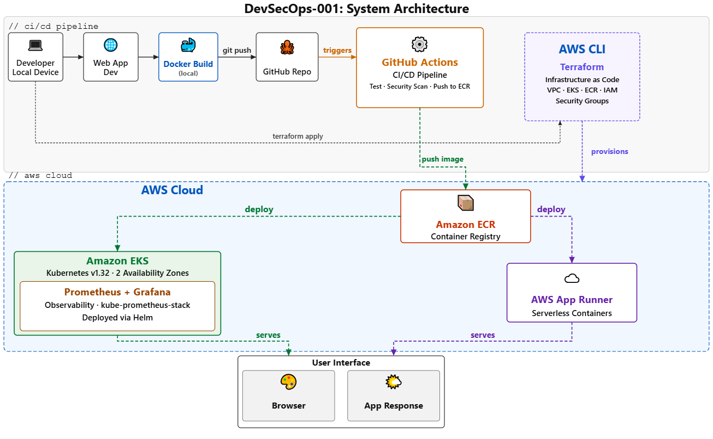

-----

## 🔐 Security Considerations

Security was considered at every layer of this project - from how credentials are stored, to how the cluster is accessed, to what is intentionally left as a known weakness. This section documents the decisions made, the protections in place, and the vulnerabilities that exist so they can be understood and improved upon.

-----

### ✅ What Is Secured

**Secrets Management**
- AWS credentials are managed via OIDC - GitHub Actions assumes an IAM role directly using a short-lived token. No static AWS access keys are stored anywhere in the project.
- The weather API key is passed as an environment variable at runtime, not baked into the Docker image
- No secrets appear in the `Dockerfile`, application code, or Terraform files
- `.gitignore` prevents sensitive files such as `terraform.tfstate` and `.env` from being committed

**IAM and Access Control**
- The project uses a dedicated IAM user rather than the root AWS account.
- EKS cluster access is managed via **EKS Access Entries** - the modern and recommended approach over the legacy `aws-auth` ConfigMap
- The App Runner service uses a dedicated IAM role (`AppRunnerECRAccessRole`) scoped only to ECR read access - it cannot access anything else in AWS
- EKS worker node IAM roles follow least privilege - nodes can pull from ECR but have no unnecessary permissions

**Identity and Access Credentials Exposure**
- The basic error of accidental exposure of identity and access credentials such as account IDs, usernames, etc can easily occur in portfolio projects such as this one due to extensive use of screenshots. Attention has been duly paid (e.g. to constituent parts of AWS ARNs) and all such potential exposure redacted from screenshots

**Container and Registry Security**
- Container images are stored in a **private** Amazon ECR repository - not on a public registry like Docker Hub
- Images are tagged with both `latest` and the **Git commit SHA**, making every build traceable and immutable
- ECR provides built-in image scanning for known OS and dependency vulnerabilities on push

**Network Isolation**
- The EKS cluster is deployed inside a **VPC** with public and private subnets across two Availability Zones
- Worker nodes sit in private subnets - they are not directly reachable from the internet
- Security groups restrict traffic to only the ports and protocols needed

**Namespace Isolation**
- The monitoring stack (Prometheus, Grafana, AlertManager) runs in a dedicated `monitoring` namespace, isolated from the application workloads in the default namespace
- Namespace separation limits the blast radius if a workload is compromised

**App Runner**
- AWS App Runner automatically provisions and manages **HTTPS/TLS** for the public URL - no certificate configuration required
- The service pulls from ECR using an IAM role, not long-lived static credentials

-----

### ⚠️ Known Vulnerabilities and Weaknesses

These are real security gaps in the current setup. They are documented here honestly because understanding weaknesses is as important as documenting strengths

**Grafana Exposed Over HTTP**
- The Grafana LoadBalancer URL runs over plain HTTP, not HTTPS - visible as "Not secure" in the browser
- This means credentials and dashboard data are transmitted unencrypted
- **Fix:** Configure a TLS certificate via AWS Certificate Manager and attach it to the LoadBalancer, or use an NGINX ingress with cert-manager

**Weak Grafana Password**
- The Grafana admin password is set at install time via a Helm flag and is not strong. It is documented in the Known Vulnerabilities section above without being disclosed here
- **Fix:** Use a Kubernetes Secret to pass the password, and enforce a strong randomly generated value in production

**Prometheus Has No Authentication**
- Prometheus is exposed internally with no authentication layer
- Any pod inside the cluster that can reach the `monitoring` namespace can query all metrics
- **Fix:** Enable Prometheus authentication or restrict access using Kubernetes Network Policies

**No Network Policies Defined**
- There are no Kubernetes `NetworkPolicy` resources in this project, meaning any pod can communicate with any other pod across namespaces by default
- **Fix:** Define ingress and egress Network Policies to restrict inter-pod communication to only what is needed

**EKS API Endpoint Is Publicly Accessible**
- The EKS cluster API endpoint is reachable from the public internet (protected by IAM, but still exposed)
- **Fix:** Set `endpoint_public_access = false` in Terraform and use a bastion host or VPN for cluster access

**No Pod Security Standards Enforced**
- Kubernetes Pod Security Standards (PSS) are not configured, meaning pods could theoretically run as root without restriction
- **Fix:** Enable the `restricted` or `baseline` PSS policy on namespaces

**Terraform State Stored Locally**
- `terraform.tfstate` is stored on the local CloudShell filesystem, not in a remote backend
- If the CloudShell session resets or the file is lost, Terraform loses track of what it has created
- **Fix:** Configure an S3 backend with DynamoDB state locking for shared and persistent state management

-----

### 🧠 Security Decisions Explained

|         Decision                           |             Why                                                       |
|--------------------------------------------|-----------------------------------------------------------------------|
| GitHub Secrets over hardcoded credentials  | Prevents credentials appearing in git history or logs                 |               
| Private ECR over Docker Hub                | Keeps images internal to AWS - not publicly pullable                  |    
| Dedicated IAM user over root               | Root account should never be used for programmatic access             |
| EKS Access Entries over aws-auth ConfigMap | AWS recommended approach - ConfigMap editing can break cluster access |
| Separate monitoring namespace              | Limits access scope and reduces blast radius                          |
| SHA-tagged images alongside latest         | Ensures every deployment is auditable and reproducible                |
| App Runner for public-facing URL           | Managed TLS out of the box - no certificate management needed         |

-----

### 🔮 What Would Be Added in a Production Setup

- **HTTPS everywhere** - TLS on Grafana and all internal services via cert-manager
- **Secrets Manager** - AWS Secrets Manager or HashiCorp Vault for runtime secret injection
- **Remote Terraform state** - S3 and DynamoDB backend with state locking
- **IRSA (IAM Roles for Service Accounts)** - Fine-grained IAM permissions per Kubernetes pod, not per node
- **Image signing** - Cosign or AWS Signer to verify image integrity before deployment
- **SAST/DAST scanning** - Static and dynamic security scanning in the GitHub Actions pipeline
- **Kubernetes Network Policies** - Explicit allow-list for all inter-service communication
- **Audit logging** - AWS CloudTrail and EKS audit logs shipped to CloudWatch or a SIEM
- **Improve Pytest Coverage** - Take active measures to improve coverage to >= 90%

-----

## 🏆 Achieving Major Milestones

### 1. Create app and run locally without Docker
On localhost 127.0.0.1 , port 5000 (Flask)<br>
<br>

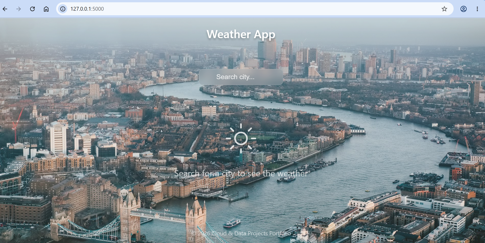<br>
<br>

### 2. Run Pytest Suite Test
38 items, 77% coverage<br>
<br>

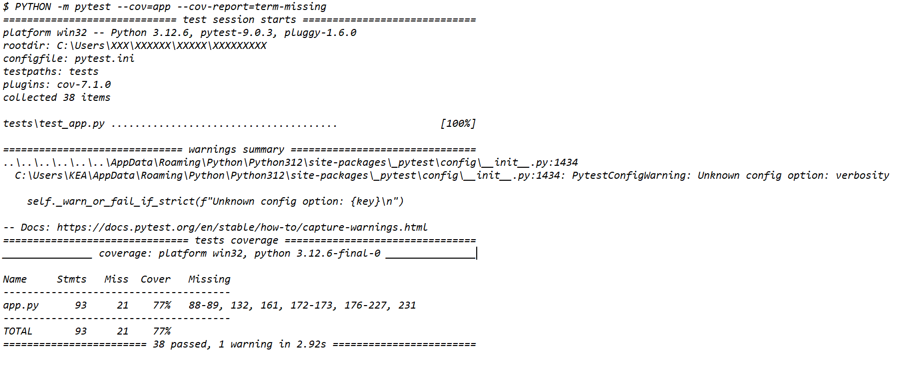<br>

The 77% coverage score is normal and in this context a solid baseline from which to make improvements in subsequent code reviews .While it falls just short of the traditional 80% industry benchmark, it indicates that the vast majority of the codebase is being executed during the test suite.<br>
Context matters - 77% coverage on a critical financial transaction module or platform is risky and might be considered unacceptable. However, 77% on a web application where the remaining 23% consists of untestable local setup files and basic error handling is fair for initial trials.<br>
Measures to improve coverage would include:<br>
- Identify missing gaps by generating an interactive HTML coverage report to see exactly which specific lines of code are not being executed
- Create functions to test edge cases and error paths
- Use `# pragma: no cover` sparingly for genuinely untestable lines (e.g. `if __name__ == "__main__":` ) to exclude them explicitly, rather than letting them drag the coverage number down
- For a production environment, set a coverage minimum gate in ci.yml, e.g.<br>
 `python -m pytest --cov=<app or project or software name> --cov-fail-under=85`<br>
<br>

### 3. Docker - Build the Image and Run the Container 
Image built:<br>
<br>

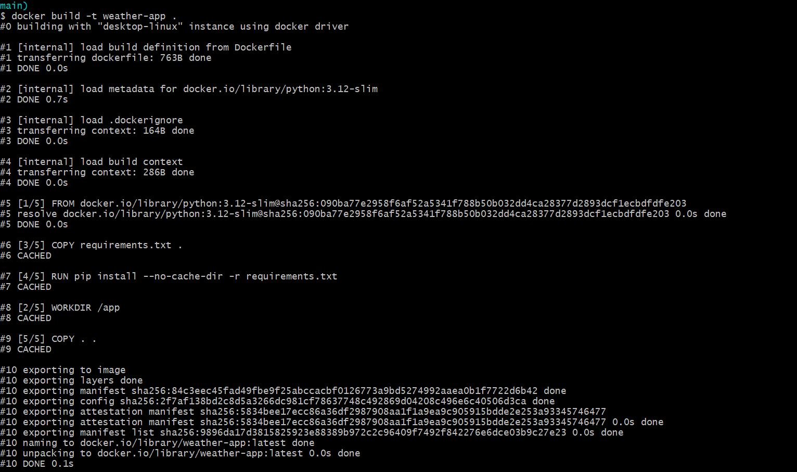<br>
<br>

Weather app runs smoothly in container:<br>
<br>

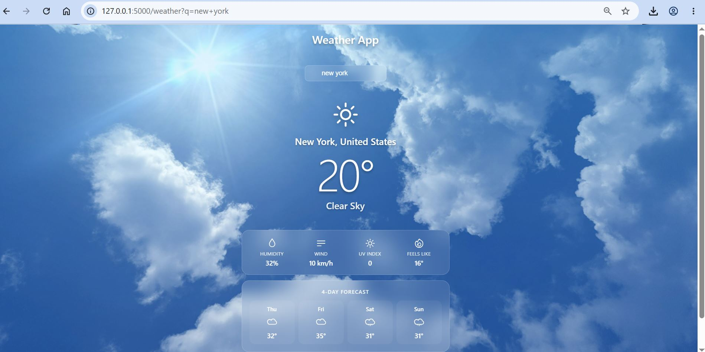<br>
<br>

### 4. Security Scanning (Bandit + pip-audit + Trivy)
Automated security tests:<br>
<br>

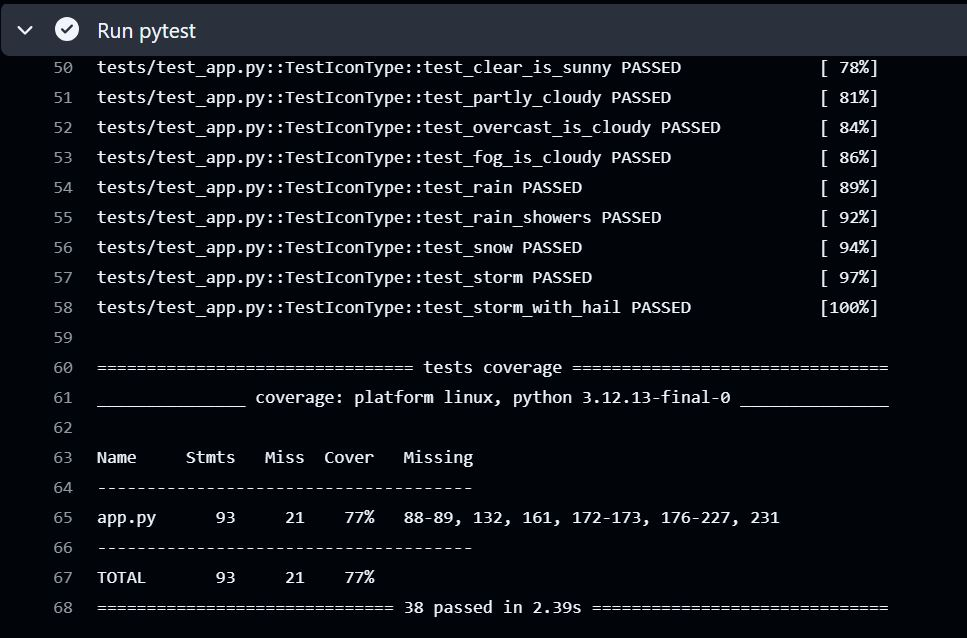<br>
<br>

Testing the Gate:<br>
Deliberately break a test to confirm the gate works:<br>

```text

def test_home_returns_200(self, client):
    response = client.get("/")
    assert response.status_code == 999  # wrong - deliberately changed from 200 to 999

```

Pipeline gate blocks on test failure, and is restored when script is corrected:<br>
<br>

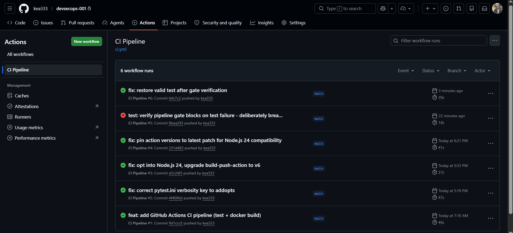<br>
<br>

### 5. Amazon ECR - Elastic Container Registry stores Docker images in AWS so they can be pulled by EKS and App Runner.<br>
Every push to the `main` branch automatically triggers a pipeline that builds and pushes a fresh Docker image to ECR:<br>
<br>

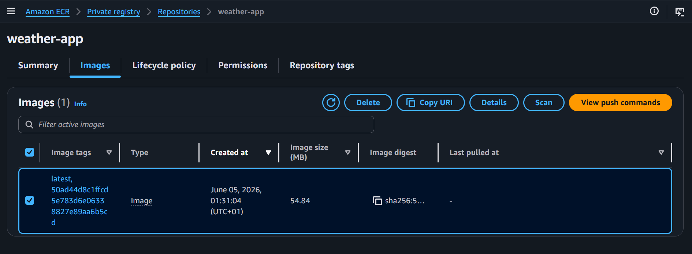<br>
<br>

### 6. Deployment 1 - Amazon EKS (Kubernetes)<br>
Amazon EKS runs the app as a containerised workload managed by Kubernetes:<br>
<br>

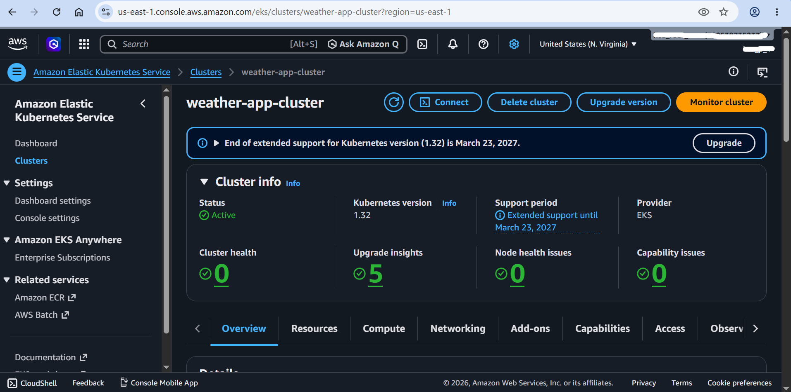<br>
<br>

Active worker nodes:<br>
<br>

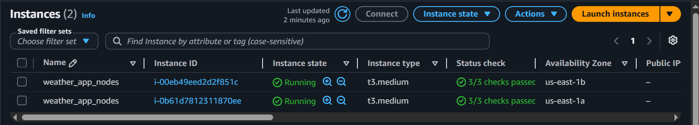<br>
<br>

### 7. Deploy the Application - Weather App Works Perfectly
Weather app served via EKS:<br>
<br>

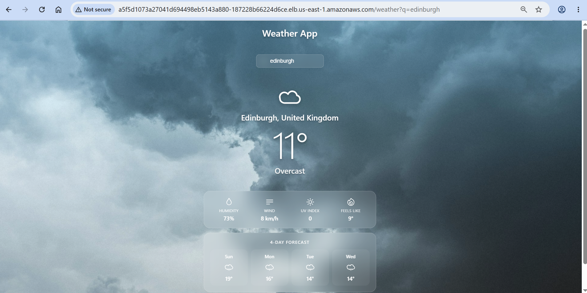<br>
<br>

### 8. Deployment 2 - AWS App Runner (Serverless) with Managable Costs ( ~ $2.52 per month)
App Runner provisioned:<br>
<br>

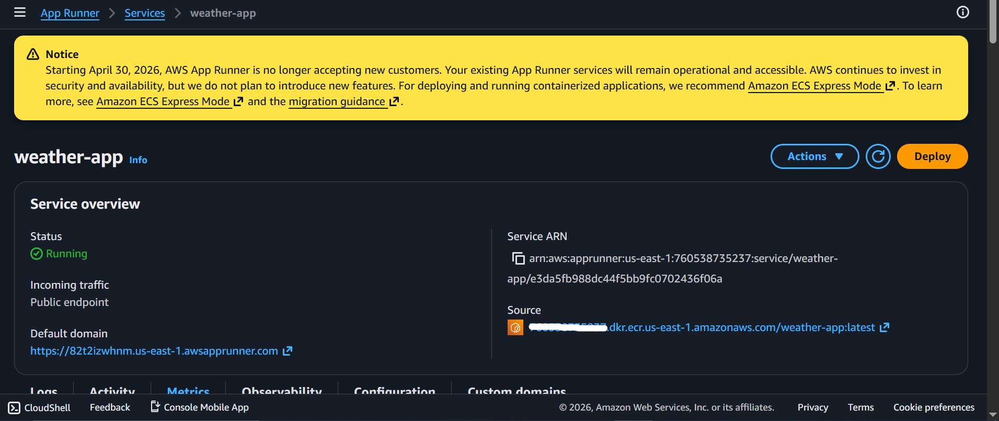<br>
<br>

Weather app served via App Runner:<br>
<br>

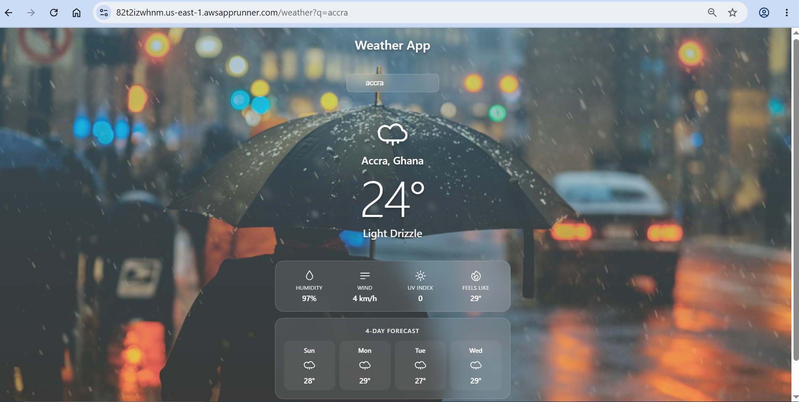<br>
<br>

### 9. Monitoring - Prometheus and Grafana - deployed directly onto the EKS cluster using Helm.
Prometheus deployed:<br>
<br>

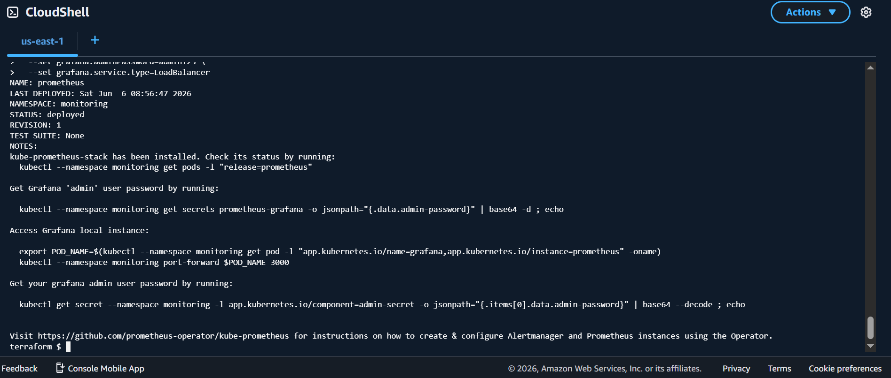<br>
<br>

### 10. Log Into Grafana to monitor cloud-native environment and application.
Infrastructure monitoring - CPU and memory:<br>
<br>

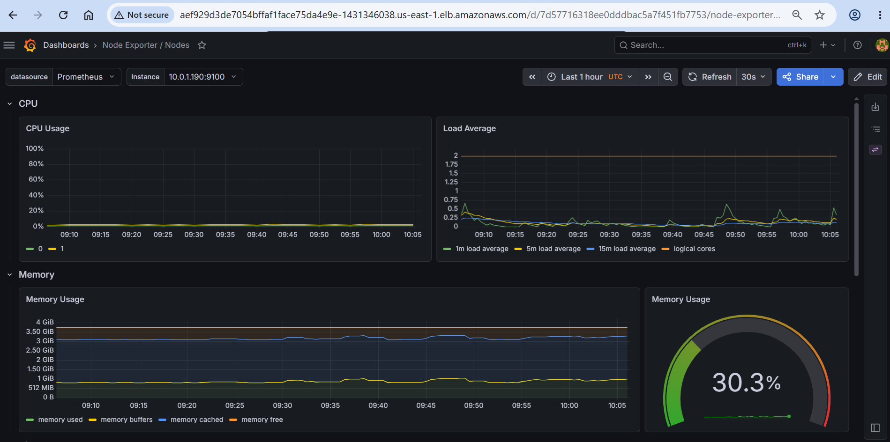<br>
<br>

Infrastructure monitoring - disk and network:<br>
<br>

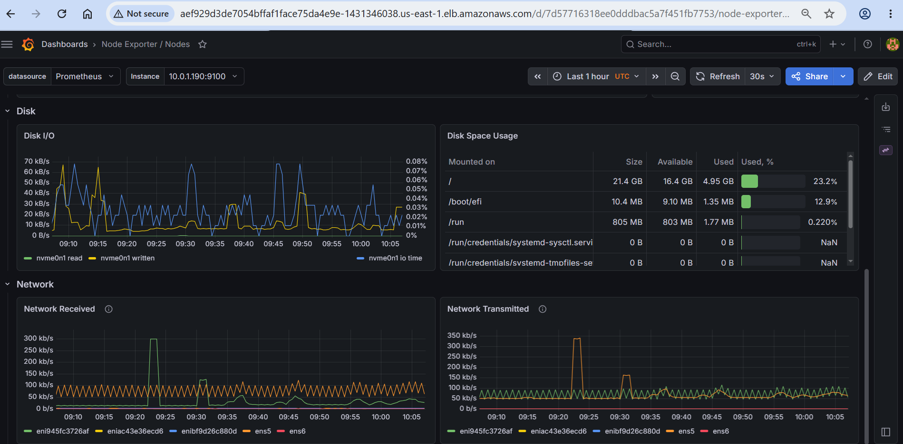<br>
<br>

### 11. App Runner Deployment Automated - From Manual Console to GitHub Actions CI/CD Pipeline (Job 7)
App Runner was initially deployed manually via the AWS Console to validate the setup. Having confirmed it works, deployment is now fully automated - triggered automatically on every push to main via Job 7 in the CI/CD pipeline:<br>
<br>

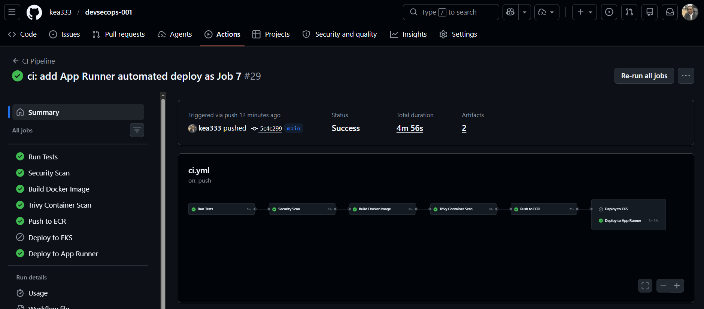<br>
_\*At this stage, deploy to EKS is intentionally skipped - that is because EKS cluster has been torn down for cost control. When desirable, it is easily re-enabled by setting `EKS_ENABLED` to `true` once the cluster is reprovisioned via Terraform*_

<br>

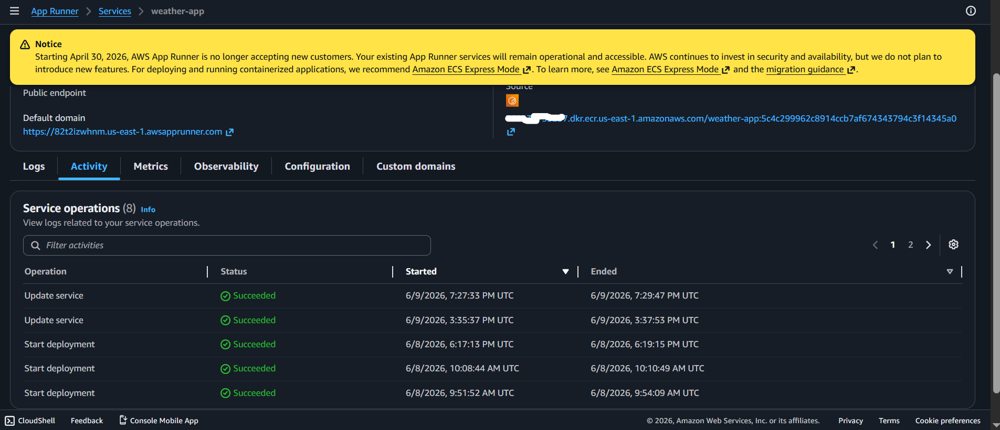
-----

### Acknowledgement

> Thank you to [Sathish Chandra Boini](https://www.linkedin.com/in/hackerpreneur/) for the _Problem Statement_ and direction.
